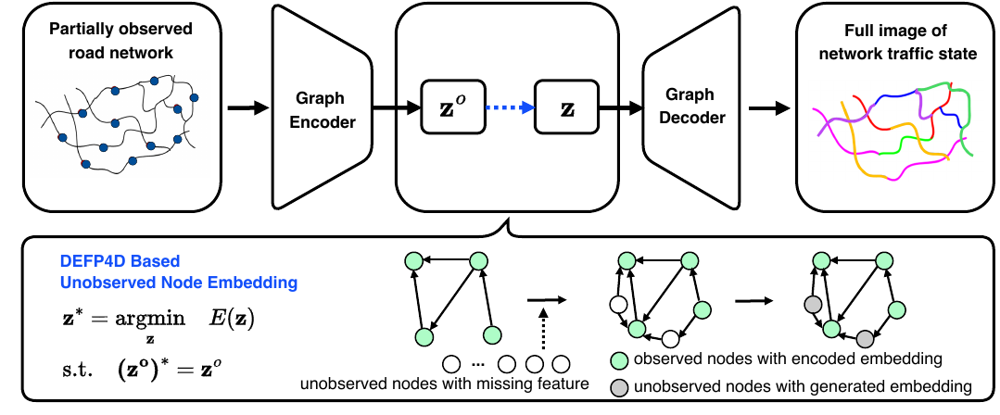
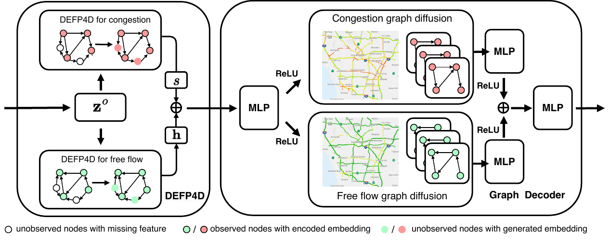
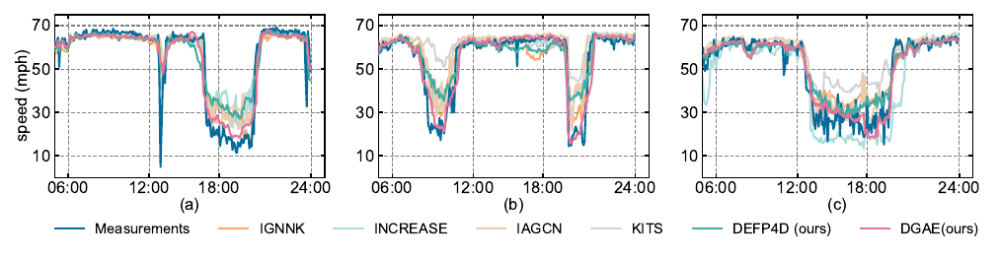
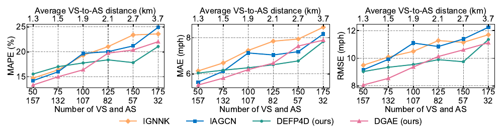

# DGAE    

The repo is the official implementation for [Network-wide Freeway Traffic Estimation Using Sparse Sensor Data: A Dirichlet Graph Auto-Encoder Approach](https://arxiv.org/abs/2503.15845).

## Introduction 
Network-wide Traffic State Estimation (TSE) aims to infer the complete traffic state of a road network using only sparsely deployed sensors, and plays a vital role in intelligent transportation systems.

In this work, we present DGAE (Dirichlet Graph Auto-Encoder), a novel inductive graph representation model that leverages Dirichlet Energy-based Feature Propagation for Directed Graphs (DEFP4D), enabling accurate and efficient estimation of traffic states at unobserved locations.
## Overall Architecture
DGAE consists of two main components: a graph auto-encoder (GAE) and Dirichlet energy-based feature propagation (DEFP4D). The model encodes observed node information, propagates embeddings to all nodes using DEFP4D, and decodes the complete traffic state, enabling accurate estimation for segments without sensors.

 Fig.1. Illustration of foundational framework Dirichlet graph auto-encoder.

 Fig.2. Illustration of the refined DGAE architecture. The Graph Encoder structure, identical to the Graph Decoder, is omitted here for brevity. MLP denotes Multi-Layer Perceptron, ReLU denotes the activation function and ⊕ represents element-wise addition operation.

## Usage
1. Download the dataset from [Google Cloud](https://drive.google.com/file/d/1VCPGVljJzdBTfhardAiOZNimxGDXiOiw/view?usp=sharing) and put them into ./data/
2. Train DGAE / Execute DEFP4D
```sh
bash scripts/DGAE.sh
```
```sh
bash scripts/DEFP4D.sh
```

## Main Results

 Fig.3. State estimation results for METR-LA: (a) Sensor #1, (b) Sensor #70, (c) Sensor #131

 Fig.4. Model performance with different sensor deployment density on METR-LA dataset. The first row of x-ticks labels indicates the number of VS, while
the second row shows the number of VS.
## Citation
If you find this repo helpful, please cite our paper.

```
@misc{zhou2025DGAE,
  title = {Network-Wide {{Freeway Traffic Estimation Using Sparse Sensor Data}}: {{A Dirichlet Graph Auto-Encoder Approach}}},
  shorttitle = {Network-Wide {{Freeway Traffic Estimation Using Sparse Sensor Data}}},
  author = {Zhou, Qishen and Zhang, Yifan and Makridis, Michail A. and Kouvelas, Anastasios and Wang, Yibing and Hu, Simon},
  year = {2025},
  month = mar,
  number = {arXiv:2503.15845},
  eprint = {2503.15845},
  primaryclass = {cs},
  publisher = {arXiv},
  doi = {10.48550/arXiv.2503.15845},
  archiveprefix = {arXiv}
}

```

## Contact
If you have any questions, feel free to contact:
- Qishen Zhou (qishenzhou@intl.zju.edu.cn)